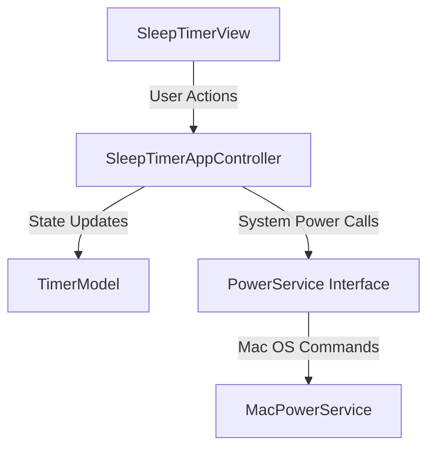

# SleepTimer 😴

A sleek, modern macOS desktop application and menu bar tray tool for scheduling system sleep and hibernation. 

Built in Python using native Tkinter graphics and AppKit menu bar integration (`rumps`), structured around a clean **Object-Oriented Model-View-Controller (MVC)** software engineering architecture.

---

## Features

- ⭕ **Circular Countdown Progress Ring**: Custom canvas rendering an animated 360-degree progress arc and bold countdown timer.
- ⏱️ **3-Box HMS Duration Input**: Dedicated input fields for Hours (`h`), Minutes (`m`), and Seconds (`s`) with live, real-time target sleep calculation (`Sleep scheduled for HH:MM:SS`).
- ⚡ **Quick Preset Duration Pills**: One-click duration setting (`15m`, `30m`, `45m`, `1h`, `2h`) with active pill highlights.
- 🔔 **macOS Menu Bar Tray Integration**: Seamless tray status display (`00:29:59 😴`) with inter-process POSIX signal handling (`SIGUSR1` / `SIGUSR2`) to bring the main window to front or cancel the timer.
- 🔒 **Native Hibernation Execution**: Automatically locks the macOS user session (`CGSession`) and puts system hardware into safe sleep (`pmset`).

---

## Object-Oriented Architecture (MVC)

Designed for academic software engineering standards:



- **`TimerModel`**: Encapsulates domain logic, H/M/S parsing, remaining progress fraction, and time string calculations.
- **`SleepTimerView`**: Encapsulates GUI widget construction, 3-box HMS input fields, and custom canvas rounded shapes.
- **`SleepTimerAppController`**: Coordinates interactions between View and Model, manages background timer threads, sub-process lifecycle, and POSIX signals.
- **`PowerService` (Interface) & `MacPowerService`**: Implements the **Dependency Inversion Principle (DIP)** to decouple OS side-effects (`pmset`, `osascript`) from GUI logic for unit testing.

---

## Installation & Requirements

### Requirements
- macOS 11.0 Big Sur or later
- Python 3.10+

### Installation
Install project dependencies using `requirements.txt`:

```bash
pip install -r requirements.txt
```

---

## How to Run

Launch the application directly from the application bundle executable:

```bash
/Applications/SleepTimer.app/Contents/MacOS/SleepTimer
```

---

## Project Structure

```text
SleepTimer.app/
├── .gitignore
├── LICENSE.txt
├── README.md
├── requirements.txt
└── Contents/
    ├── Info.plist
    ├── MacOS/
    │   ├── MenuBarTimer.py
    │   └── SleepTimer
    └── Resources/
        └── AppIcon.icns
```

---

## License

Distributed under the [MIT License](LICENSE.txt). Copyright (c) 2026 Lorenzo Manna.
