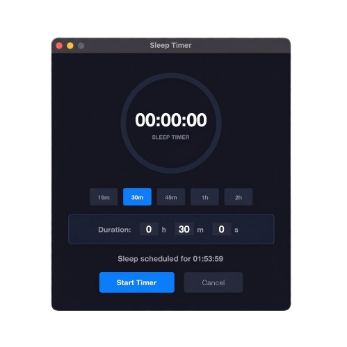

# A SleepTimer for MacOS 😴

A sleek, modern macOS application and menu bar tray tool for scheduling system sleep and hibernation.

<p align="center">
  
</p>

---

### Overview

SleepTimer allows you to easily set a sleep countdown for your Mac. Once the countdown finishes, your screen locks and your Mac safely goes to sleep.

### Key Features

- ⏱️ **Simple Time Entry**: Type exact hours, minutes, or seconds, or pick quick preset buttons (`15m`, `30m`, `45m`, `1h`, `2h`).
- 🕒 **Live Clock Preview**: See the exact time your Mac will sleep as you type.
- ⭕ **Visual Countdown Ring**: See remaining time at a glance with a clean circular ring.
- 🔔 **Menu Bar Status**: Follow the countdown right from your Mac menu bar.
- 🔒 **Auto Screen Lock & Sleep**: Locks your screen and puts your Mac to sleep when time runs out.

---

## 👤 For Users

### How to Install & Use

1. Download `SleepTimer-v1.1.0-macOS.zip` from [GitHub Releases](https://github.com/LorenzoManna/MacOS-Sleep-Timer/releases).
2. Extract the downloaded `.zip` file.
3. Open Terminal in the extracted folder and run the included installation script:
   ```bash
   sudo ./install.sh
   ```
4. Open **`SleepTimer.app`** from your **Applications** folder or Launchpad.

---

### 🛡️ Why `sudo` is Required

When downloading applications directly from GitHub or the web without an Apple Developer code-signing certificate, macOS automatically assigns a **quarantine flag** (`com.apple.quarantine`) to the downloaded files. This causes Gatekeeper to display an error stating:
> *"Apple could not verify SleepTimer is free of malware..."*

The `install.sh` script does three things:
1. Automatically installs Python dependencies (`rumps`, `pyobjc-framework-Cocoa`) using `python3 -m pip install -r requirements.txt`.
2. Moves `SleepTimer.app` into `/Applications` (requiring `sudo` administrative rights to write to system applications directory).
3. Runs `sudo xattr -cr /Applications/SleepTimer.app`, which recursively clears all extended quarantine attributes (`-c`) and folder metadata (`-r`).

Clearing the quarantine flag tells macOS Gatekeeper that you explicitly trust the application binary so it opens normally without security warnings.


---

## 💻 For Developers

### Prerequisites

- macOS 11.0 (Big Sur) or later
- Python 3.10+

### Setup & Dependencies

1. Clone the repository:

   ```bash
   git clone https://github.com/LorenzoManna/MacOS-Sleep-Timer.git
   cd MacOS-Sleep-Timer
   ```

2. Install Python dependencies:

   ```bash
   pip install -r requirements.txt
   ```

   > **Note**: `tkinter` is included with standard Python installations.

### Running from Source

Execute the main application script:

```bash
python3 Contents/MacOS/SleepTimer
```

### Project Structure

```text
SleepTimer.app/
├── .gitignore
├── LICENSE.txt
├── README.md
├── requirements.txt
├── assets/
│   └── screenshot.png
└── Contents/
    ├── Info.plist
    ├── MacOS/
    │   ├── MenuBarTimer.py
    │   └── SleepTimer
    └── Resources/
        └── AppIcon.icns
```

---

## 📄 License

Distributed under the [MIT License](LICENSE.txt). Copyright (c) 2026 Lorenzo Manna.
