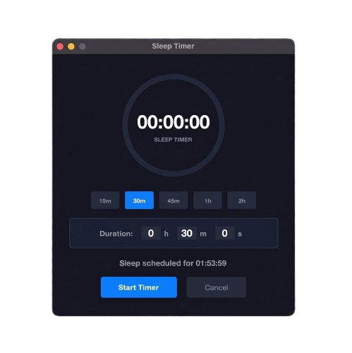

# SleepTimer for macOS 😴

**Fall asleep to your favorite movies, TV shows, podcasts, and music without worrying about your Mac staying on all night.**

SleepTimer is a sleek, native macOS menu bar and countdown utility designed for bedtime viewing and listening. Set your timer, drift off to sleep, and let your Mac handle the rest.

<p align="center">
  
</p>

---

### ✨ The Perfect Bedtime Companion

Do you love falling asleep to a movie on Netflix, videos on YouTube, or relaxing music on Spotify, but hate waking up to a bright screen and a dead battery at 3 AM?

When your countdown ends, SleepTimer puts your Mac and displays directly into sleep mode.

Videos, music, and streams automatically stop playing immediately, saving battery, eliminating screen glare, and letting you rest in peace.

---

## 👤 For Users

### How to Install & Use

#### Option 1: Quick Install via `curl` (One-liner)

```bash
curl -fsSL https://raw.githubusercontent.com/LorenzoManna/MacOS-Sleep-Timer/main/install.sh | bash
```

#### Option 2: Manual Download (.zip)

1. Download **`SleepTimer-v0.2.0-macOS.zip`** from [GitHub Releases](https://github.com/LorenzoManna/MacOS-Sleep-Timer/releases).
2. Extract the `.zip` file and drag **`SleepTimer.app`** into your **Applications** folder.
3. **First Launch (macOS Gatekeeper)**:
   - Double-click `SleepTimer.app` (if blocked by macOS, click **Done**).
   - Go to **System Settings** ➔ **Privacy & Security**, scroll down to **Security**, and click **Open Anyway**.
   - *(Or run `xattr -cr /Applications/SleepTimer.app` in Terminal).*
   - *(You only need to do this once—macOS remembers your approval permanently).*

---

## 💻 For Developers

### 🎓 Why Python & Not Swift?

While native macOS applications are traditionally built with Swift and Xcode, SleepTimer was created as an academic project to offer an accessible, introductory pathway to learning real-world programming and software engineering practices.

To provide a seamless end-user experience, the codebase is compiled into a standalone macOS `.app` bundle using PyInstaller and Apple `ditto`. This packages the runtime into a self-contained Mach-O binary, allowing SleepTimer to run natively on macOS with zero external Python prerequisites.

### Prerequisites

- macOS 14.0 (Sonoma) or later
- Python 3.11+

### Setup & Dependencies

1. Clone the repository:

   ```bash
   git clone https://github.com/LorenzoManna/MacOS-Sleep-Timer.git
   cd MacOS-Sleep-Timer
   ```

2. Install dependencies with **Poetry**:

   ```bash
   poetry install
   ```

   > **Note**: Poetry is pre-configured (`poetry.toml`) to automatically create an isolated in-project virtual environment (`.venv/`) for system safety and seamless IDE integration.

   *(Alternatively using pip: `pip install -r requirements-dev.txt` for development or `pip install -r requirements.txt` for runtime)*

### Running from Source

Run the app using Poetry:

```bash
poetry run sleeptimer
```

*(Or directly via Python: `python3 Contents/MacOS/SleepTimer`)*

### 🧪 Running Tests

Run the test suite via Python's standard `unittest`:

```bash
poetry run python -m unittest discover -s tests
```

*(Or using pip / system Python: `python3 -m unittest discover -s tests`)*

### 🔨 Build Automation

Build the standalone `.app` bundle and release zip archive:

```bash
poetry run build-app
```

*(Or run `./build_app.sh`)*

### Project Structure

```text
MacOS-Sleep-Timer/
├── .gitignore
├── LICENSE.txt
├── README.md
├── pyproject.toml
├── poetry.toml             # In-project .venv configuration
├── poetry.lock
├── requirements.txt
├── requirements-dev.txt
├── install.sh
├── build_app.sh
├── sleeptimer_build.py
├── tests/                  # Unittest suite
│   ├── test_model.py
│   ├── test_controller.py
│   ├── test_power_service.py
│   ├── test_menubar.py
│   └── test_build.py
├── assets/
│   └── screenshot.png
└── Contents/
    ├── Info.plist
    ├── MacOS/
    │   ├── MenuBarTimer.py
    │   └── SleepTimer
    └── Resources/
        └── AppIcon.icns
```

---

## 📄 License

Distributed under the [MIT License](LICENSE.txt). Copyright (c) 2026 Lorenzo Manna.
